# wanna-track-Your-Company-Devices

## Description
This App is a database of Fawry Machines

1- The admin create distributor account, which every distributor has a QR Code.<br>
2- The distributor can login using username/password, or using QR code scanner.<br>
3- The distributor when he sell or deliver a Fawry Machine to a client, he add this machine into the system with its SN (serial number), client's (name, phone and location).<br>
4- The admin can view all the devices that it has been sold to clients with all details through his account.<br><br>

## Libraries and Tools
- Firebase (Database)
- Google Map SDK API (Place Picker)
- Activity
- Interface and Callbacks
- GPS
- Zxing library generator and scanner of -> QR Code and Serial Number
- Recycler View<br><br>


## Screenshots

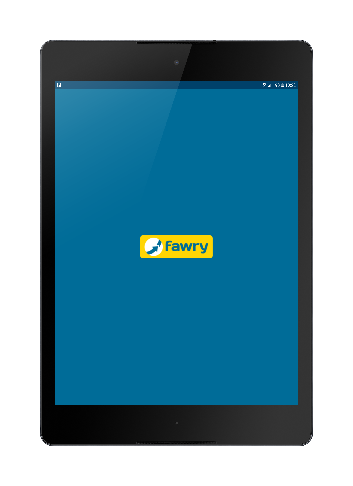 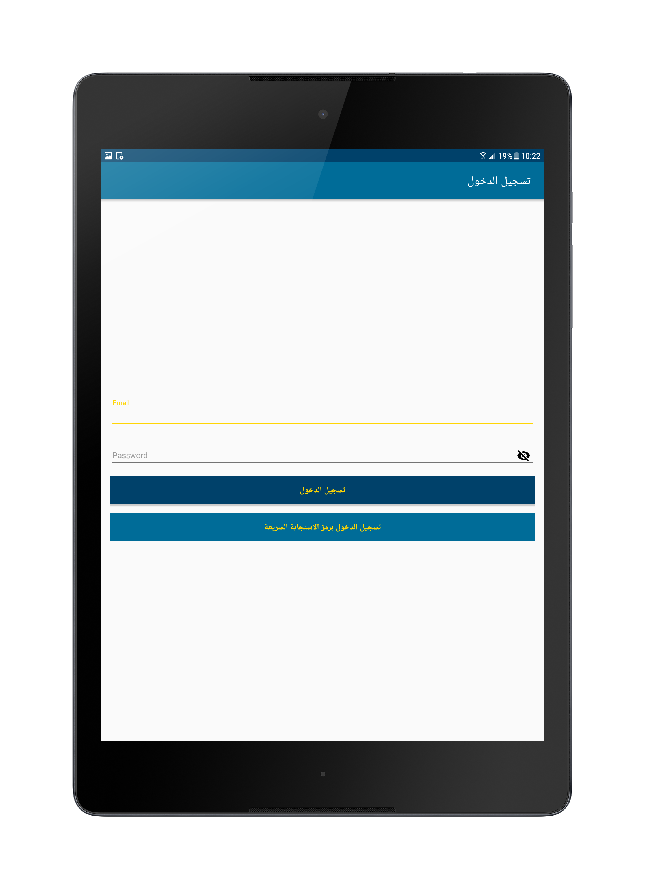
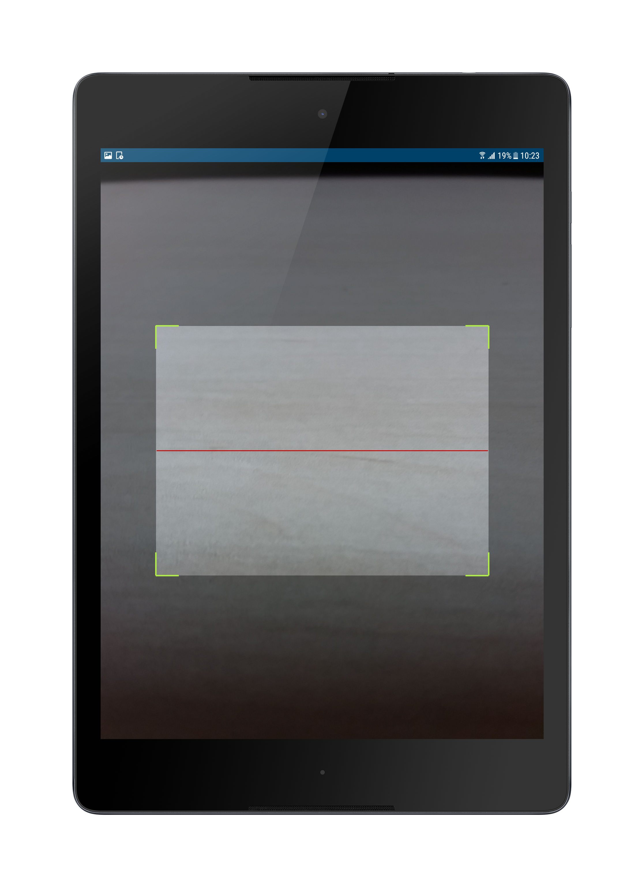 
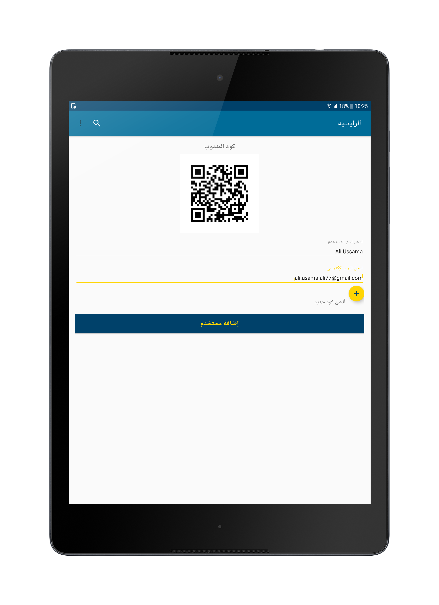 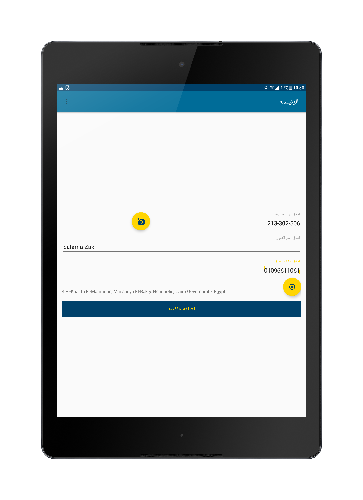
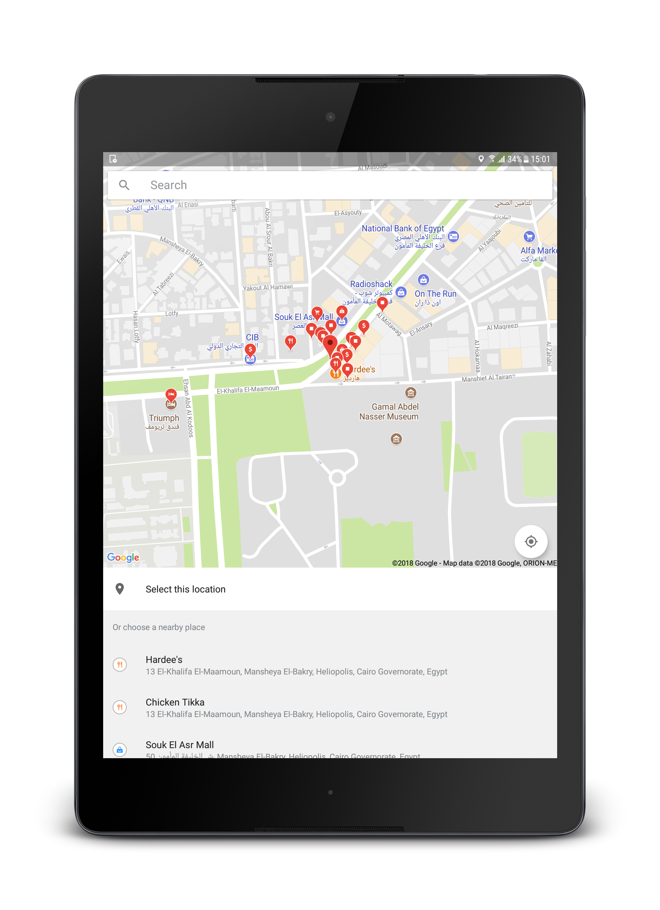 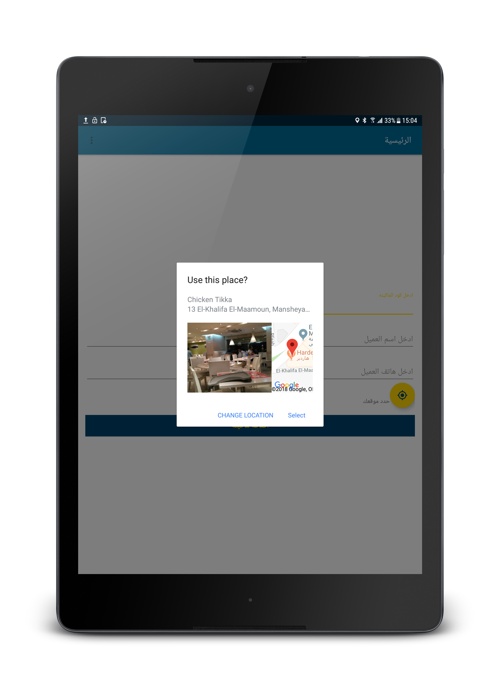
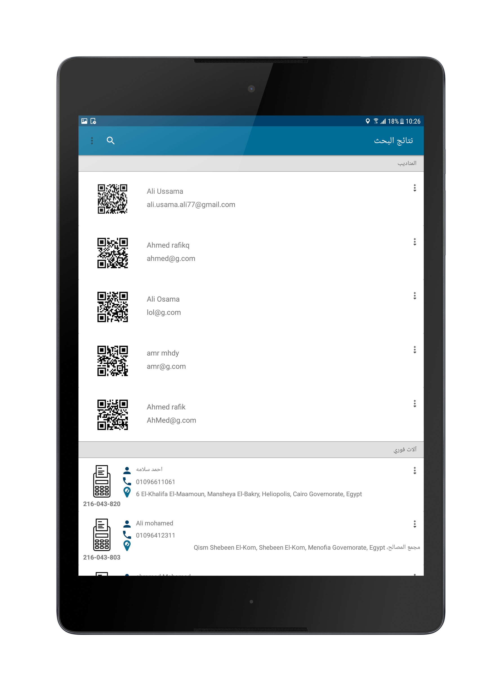 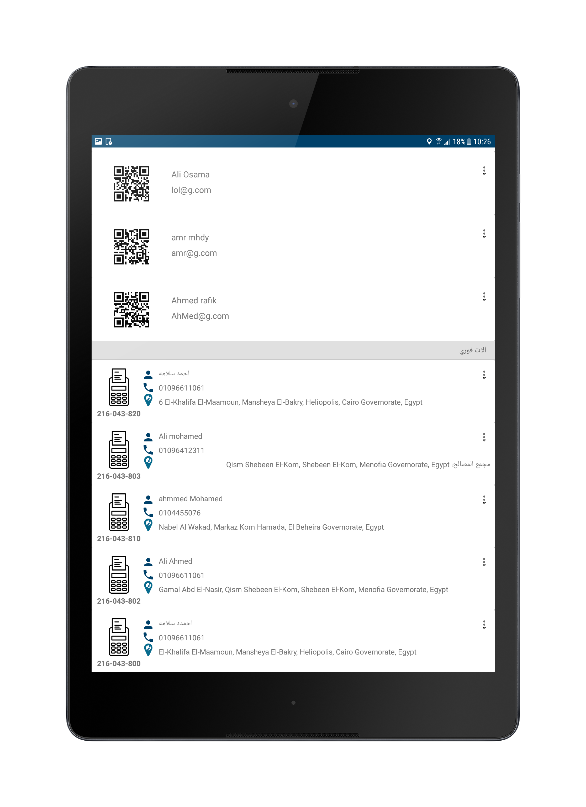
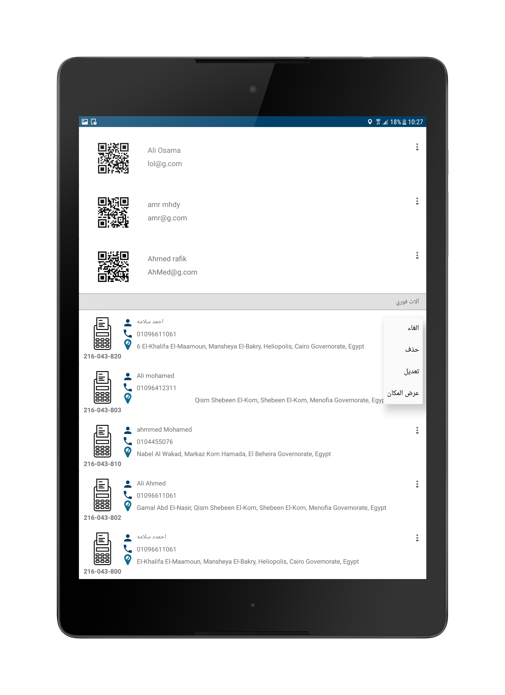 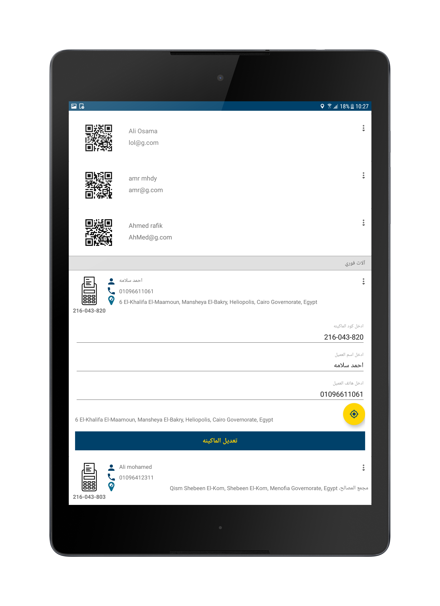
 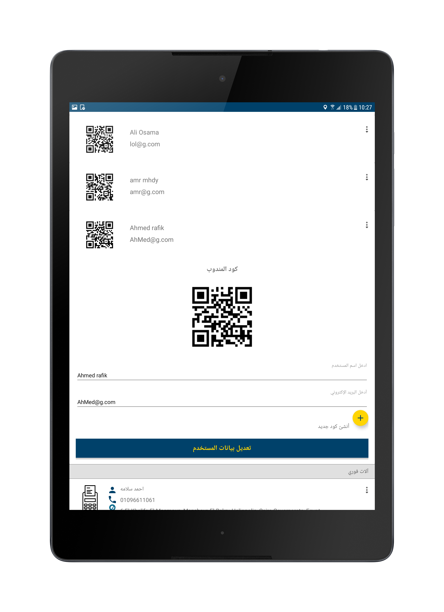


## License

* [Apache Version 2.0](http://www.apache.org/licenses/LICENSE-2.0.html)

```
Copyright 2017 Ali Ussama

Licensed under the Apache License, Version 2.0 (the "License");
you may not use this file except in compliance with the License.
You may obtain a copy of the License at

 http://www.apache.org/licenses/LICENSE-2.0

Unless required by applicable law or agreed to in writing, software
distributed under the License is distributed on an "AS IS" BASIS,
WITHOUT WARRANTIES OR CONDITIONS OF ANY KIND, either express or implied.
See the License for the specific language governing permissions and
limitations under the License.
```
